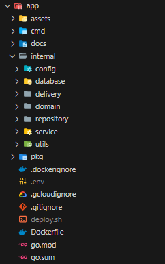

# Ordering System (Backend)

---

## 目錄

1. [作品介紹](#作品介紹) - 餐廳點餐系統介紹。
2. [負責項目](#負責項目) - 詳細列出系統開發過程中負責的後端工作項目。
3. [技術介紹](#技術介紹) - 包含系統規劃核心、技術選擇、後端程式架構、資料庫架構、API 列表等資訊。
4. [技術清單](#技術清單) - 包含了使用的後端技術和相關工具的版本與清單。

## 作品介紹

### 簡介

我與另一名前端工程師合作並設計並開發的一款餐廳點餐系統，分為 **商店管理系統（Store Ease 商店輕鬆理）** 與 **快速點餐系統（Order Ease 餐點輕鬆訂）** 兩部份；**而這個 Repository 是整個系統的後端架構。**

- **餐點輕鬆訂** （ :bell:可參考我的另外一個 Repository -> [Order Ease App](https://github.com/phzeng0726/order-ease-app-demo)）
  - 功能特色：
    - 帳戶管理： 可以 E-Mail 實名或匿名註冊，並於後續更改使用者資訊或刪除用戶
    - 快速點餐： 掃描商店生成的 QRCode，即時獲取商店菜單並快速點餐。
    - 訂單即時更新： 透過 FCM，在商店有任何訂單狀態更新時及時回饋給客戶。
    - 訂單紀錄： 紀錄所有的訂單歷史
  - 未來展望： 整合理財系統，實現預算控管與視覺化呈現。也可將訂單歷史的商家地理位置做成地圖，讓點餐也能紀錄用戶的行徑軌跡，增添趣味性。

- **商店輕鬆理**

  - 功能特色：
    - 帳戶管理： 以 E-Mail 註冊，並於後續更改使用者資訊或刪除用戶
    - 商店管理： 輕鬆管理多個商店資訊、菜單和座位配置。
    - 訂單管理： 生成 QRCode 提供給客戶，讓他們可以快速點餐，並實時接收訂單信息。
    - 即時通訊： 透過 FCM，在客戶點餐時即時接收訂單資訊，
  - 未來展望：
    整合理財系統，進行營業額統計與視覺化呈現。

### 開發時長

- 包含設計規劃與溝通，從無到建立，開發總時長**為 8 週**。

## 負責項目

- Scrum 專案管理
- 具彈性化的資料庫與系統架構設計
- Gmail SMTP 設置
- 與前端工程師溝通，設計並製作所有 RESTful APIs
  - 多國語言資料管理切換
  - 圖片上傳
  - OTP 寄送、驗證
  - 新增/讀取/編輯/刪除 **用戶**資訊（搭配 Firebase Auth）
  - 新增/讀取/編輯/刪除 **商店**、**菜單**、**類別**、**座位**、**訂單**資訊
  - 串接 FCM，即時發送與回傳**訂單狀態資訊**
- 雲端專案佈署
  - Google Cloud Run
  - MySQL (Railway)

## 技術介紹

### 專案概述

這個專案是我在業餘時間開發的，雖然是個人作品，但希望在未來仍然可以繼續擴展。因此，在架構設計上注重維護性和未來擴展性。

### 系統規劃核心

在規劃階段，我考慮了以下四個主要核心因素：

1. **商家與顧客是否該結合成一支大型 APP**

   若將商家與客戶結合成一支大型的 APP，彼此功能的業務邏輯相當分散，效能和維護性會受到影響。因此，將商家與顧客的 APP 獨立成兩個不同的 APP，並在 Database 以 `user_type` 區分用戶類別。

2. **用戶註冊安全性**

   選擇結合目前 APP 最主流的註冊方式 — Firebase Authentication 服務進行用戶註冊，在這個服務之下不需要在資料庫儲存任何密碼資訊，也不需要花費時間創建複雜的登入系統。

3. **商家管理易於擴展**

   資料庫的預設資料儲存架構需要支援多語系，並需儲存商店營業的 Timezone。此外，商店與菜單的連接由於是多對多的關係，需要建立 Mapping table 作為彈性連接的橋樑。

4. **商家與顧客之間的即時聯繫**

   商家與顧客在彼此建立訂單與更新訂單狀態時要能及時接受彼此的動態通知，採用 Firebase Cloud Messaging (FCM) 服務，讓後端存取前端的 Device Token 後能主動通知前端刷新頁面。

### 技術選擇

- **前端**：Flutter，跨平台且靈活的選擇方案。
- **後端**：使用 Golang，程式打包成 Docker Image 後，系統更輕量化。資料庫選用 MySQL。
- **雲端伺服器**：Google Cloud Run 進行容器化佈署，未來也便於遷移、擴展。搭配 Railway 佈署 MySQL，兩者均有免費額度足夠應對開發需求。

### 後端程式架構

專案資料夾架構選用後端最通用的三層式架構，**專案路徑** (📁 `app`)。確保程式的擴充性與維護性。

### 資料庫架構

綜合了 [規劃考量](#規劃考量) 後，截至目前`v1.0.0`為止，資料庫中共有 20 張表格。

- 用戶: user, user_account
- 商家管理: stores, store_opening_hours, store_seats, store_menu_mapping, menus, menu_items, menu_item_mapping, categories, category_language, category_user_mapping
- 訂單: order_tickets, order_ticket_items
- 其他: images, language, otp_mail, otp, fcm_token, fcm_messages

### API 列表 (Swagger 文件待更新)

截至目前`v1.0.0`為止，共有 40 支 RESTful API，架構為`https://<Endpoint>/api/v1/<Path>`。

## 技術清單

### Language

- **Golang** `v1.20` |

  - **Main Dependencies**

    - Gin-Gonic (`github.com/gin-gonic/gin` v1.9.1)
    - MySQL & GORM (`gorm.io/driver/mysql` v1.5.1, `gorm.io/datatypes` v1.2.0, `gorm.io/gorm` v1.25.4)

  - **All Dependencies**

    

### Cloud Services

- **Server**
  - Google Cloud Run
- **Database**
  - MySQL (Deploy on **Railway**)
- **Others**
  - Gmail SMTP (OTP mail sender)
  - Firebase Auth
  - Firebase Cloud Messaging (FCM)

### Other Tools

- **Git** (Version control)
- **Docker** (Container)
- **Postman** (API tool)
- **Trello** (Scrum pattern)
- **DrawSQL** (Database design tool)
